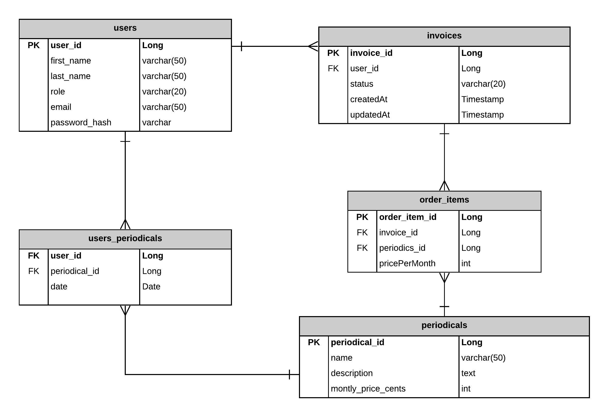

# PERIODICALS
Java external course final project 

Система Периодические издания. Администратор осуществляет ведение каталога периодических Изданий. Читатель может оформить 
подписку, предварительно выбрав периодические Издания из списка.
Система подсчитывает сумму для оплаты и регистрирует Платеж.

## Author
Serhii Horbachov

## UML
 

## Technologies

* Java 11
* PostgreSQL 
* Servlets
* JSP

## Database
 

## Installation Instructions

###Administrator workspace credentials: 
>login: admin.@mail.com

>password: password

To access User's workspace, register your own user or use predefined one: 
>login: user.@mail.com

>password: password